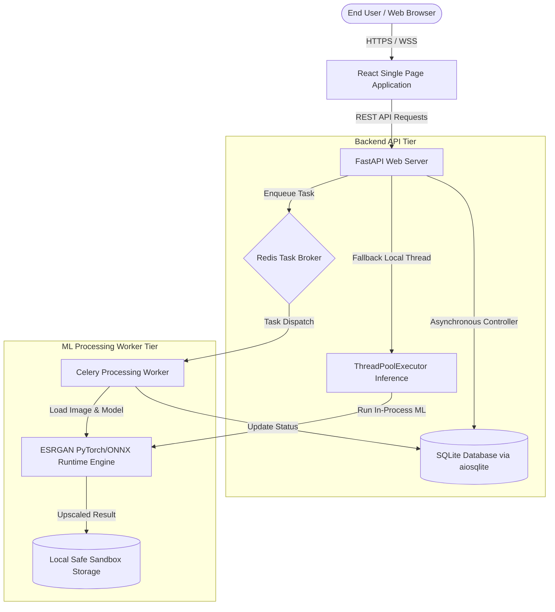
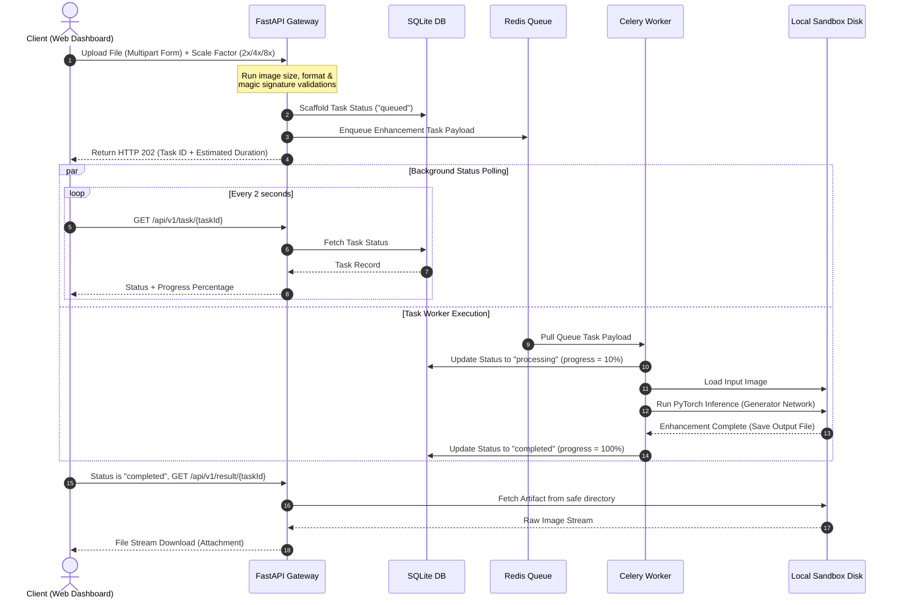
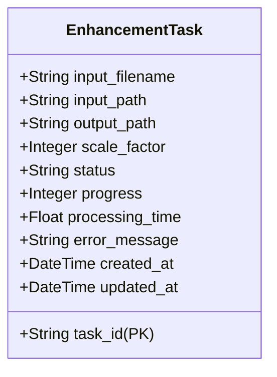

# System Architecture - ESRGAN Image Enhancer

This document details the multi-tier engineering architecture, data-flows, database relationships, and concurrent background processing strategy implemented for the **ESRGAN Image Enhancer** platform.

---

## 1. High-Level Architecture Overview

The system is split into three main isolated operational tiers:

---

## 2. Tier Components

### A. Frontend Tier (Client Dashboard)
- **Framework**: React 18, Vite (for hot module reloading and high-performance compilation), and TypeScript (strict types).
- **Global State Store**: Zustand (zero-boilerplate, high-performance state store to decouple task state and theme variables).
- **Core Interactions**: Drag-and-drop file inputs (react-dropzone), dynamic progress tracking trackers, and custom coordinate-tracking before/after slider inspection layer.

### B. Backend API Tier (FastAPI Gateway)
- **Web Application**: FastAPI running on Uvicorn. Exposes REST endpoints for image enhancements, task polling, cancellation, and artifact delivery.
- **Task Scheduling Manager**: Decouples network request thread pools from intensive ML inferences using a dual-orchestration path:
  1. **Celery Worker Fallback**: Standard configuration routes tasks to an active Redis broker for queue scheduling.
  2. **Thread Pool Executor**: If Redis is offline, the gateway utilizes safe background thread executors to process local scaling without dropping client uploads.
- **Relational Storage**: Async SQLite session database pools via SQLAlchemy and `aiosqlite` tracking metadata for historical auditing.

### C. Processing Worker Tier (Celery + PyTorch)
- **Worker Process**: Single or multi-container Celery processing environments subscribed to incoming Redis queues.
- **Super-Resolution Engine**: Houses the generator network. Supports both direct PyTorch weights (`.pth`) and GPU-accelerated ONNX runtimes.
- **Safety Pruner**: Multi-threaded periodic files cleaner that scrubs upload sandboxes and upscaled artifacts older than 24 hours to enforce absolute data privacy.

---

## 3. Detailed Data Flow Sequence

The diagram below maps the end-to-end lifecycle of an image enhancement request:

---

## 4. Database Schema Design

The SQLite database tracks execution metrics. Below is the relational entity model:

- **Index on Task Status**: An index is applied to the `status` column to accelerate status lookups.
- **Cascading Audits**: Every state shift automatically mutates the `updated_at` timestamps using SQLite hooks.
